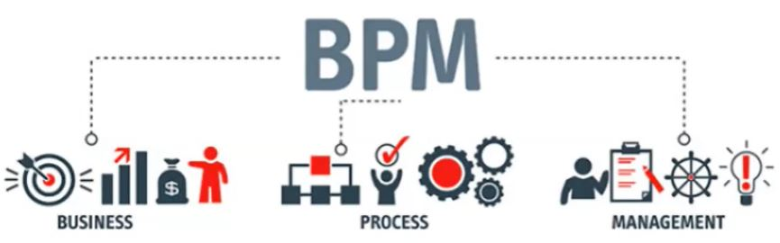
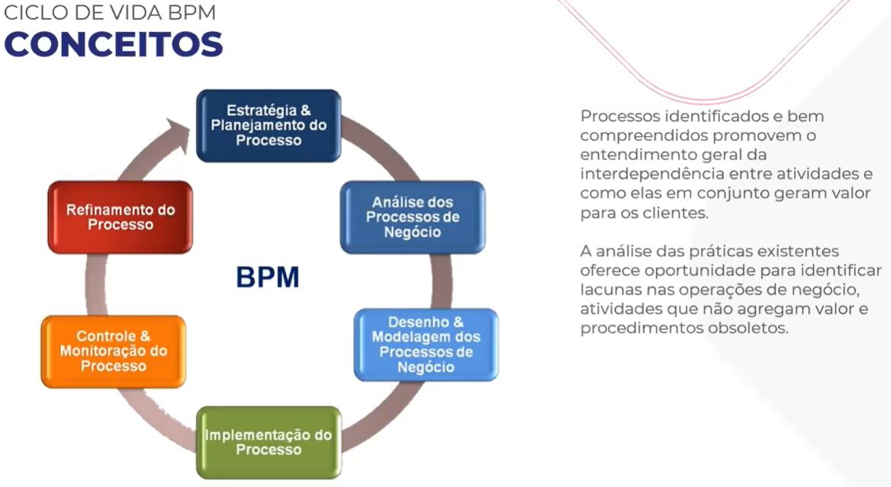
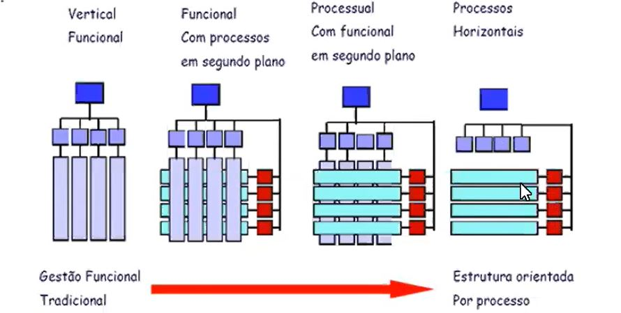
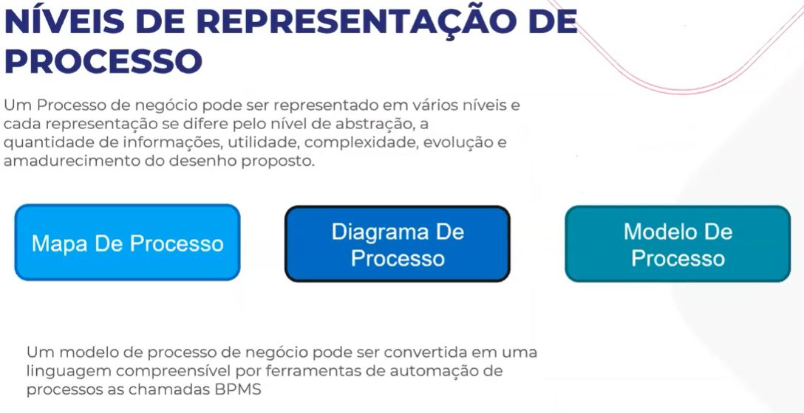

Conceitos
=====

.. _bpm:

BPM
------------

Disciplina gerencial que integra estratégias e objetivos de uma organização com expectativas 
e necessidades de clientes, por meio do foco em processos ponta a ponta.

BPM engloba estratégias, objetivos, cultura, estruturas organizacionais, papéis, políticas, métodos 
e tecnologias para analisar, desenhar, implementar, gerenciar desempenho, transformar e estabelecer governança 
de processos.

ABPMP BPM CBOK versão 3.0

Processo é uma agregação de atividades e comportamentos executados por humanos
ou máquinas para alcançar um ou mais resultados. Processo de negócio é um trabalho que entrega valor para os 
clientes ou apoia/gerencia os outros processos que agregam valor. Esse trabalho pode ser ponta a ponta,
interfuncional e até mesmo interorganizacional.

ABPMP BPM CBOK versão 3.0

Existem tipos de processos que podem ser Primário, Suporte ou Gestão.

Primário ou principal: Qualquer processo que se relaciona com o cliente e está diretamente ligado ao negócio
Suporte: Processos que apoiam os processos principais e outros processos de Suporte
Gestão: Processos que gerenciam os processos principais ou de suporte.

.. _conceito2:

Segundo conceito
------------

To use Lumache, first install it using pip:

.. code-block:: console

   (.venv) $ pip install lumache

.. _conceito3:

Ferramentas de apoio
------------

Birazi Modeler
.. image:: images/bizagi.jpg
  :width: 100
  :alt: Alternative text

Diagrams.net
.. image:: images/draw.png
  :width: 100
  :alt: Alternative text

